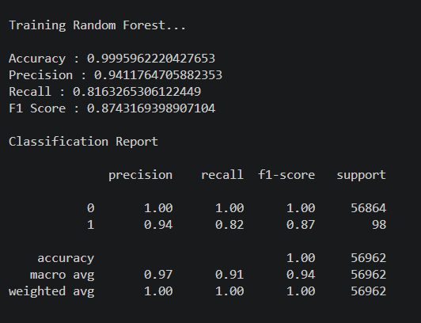

#  Credit Card Fraud Detection using Machine Learning


A machine learning project that detects whether a credit card transaction is **Genuine** or **Fraudulent** using multiple classification algorithms.

The project compares Logistic Regression, Decision Tree, and Random Forest models and selects the best-performing model based on evaluation metrics.


##  Features

- Detects fraudulent and genuine credit card transactions.
- Trains and compares multiple machine learning models.
- Selects the best-performing model based on evaluation metrics.
- Saves the trained model using Joblib.
- Predicts transactions using the saved model.
- Interactive command-line interface for testing different transactions.

##  Project Workflow

```
Credit Card Dataset
        │
        ▼
Data Preprocessing
        │
        ▼
Train-Test Split
        │
        ▼
Train Machine Learning Models
(Logistic Regression, Decision Tree, Random Forest)
        │
        ▼
Model Evaluation
        │
        ▼
Best Model Selection
        │
        ▼
Save Trained Model (model.pkl)
        │
        ▼
Predict New Transactions

##  Technologies Used

- Python
- Pandas
- NumPy
- Scikit-learn
- Joblib
```

##  Dataset Information

The project uses the **Credit Card Fraud Detection** dataset from Kaggle.

**Dataset Statistics**

- Total Transactions: **284,807**
- Genuine Transactions: **284,315**
- Fraudulent Transactions: **492**
- Total Features: **30**
- Target Variable: **Class**
  - **0** → Genuine Transaction
  - **1** → Fraudulent Transaction

Since fraudulent transactions account for only **0.17%** of the dataset, this is a highly imbalanced binary classification problem.

## 🤖 Machine Learning Models Used

Three machine learning classification algorithms were trained and evaluated:

- Logistic Regression
- Decision Tree Classifier
- Random Forest Classifier

Each model was evaluated using:

- Accuracy
- Precision
- Recall
- F1 Score

The best-performing model was selected based on its overall performance.


### 1. Logistic Regression

Logistic Regression is a supervised machine learning algorithm used for binary classification problems. In this project, it classifies each transaction as either **Genuine (0)** or **Fraudulent (1)** based on the patterns learned from the training data.

**Performance**


### 2. Decision Tree

Decision Tree is a supervised learning algorithm that makes predictions by creating a tree-like structure of decisions. It learns decision rules from the training data and classifies transactions into genuine or fraudulent categories.

**Performance**


### 3. Random Forest

Random Forest is an ensemble learning algorithm that combines multiple Decision Trees to improve prediction accuracy and reduce overfitting. It achieved the best performance among all the trained models and was selected as the final model for fraud detection.

**Performance**





##  Project Structure

```text
Credit-Card-Fraud-Detection/
│
├── creditcard.csv
├── preprocess.py
├── train_model.py
├── predict.py
├── model.pkl
├── requirements.txt
└── README.md
```
## ▶️ How to Run

### 1. Download or Clone the Repository

### 2. Install Required Libraries

```bash
pip install -r requirements.txt
```

### 3. Train the Models

```bash
python train_model.py
```

### 4. Test the Trained Model

```bash
python predict.py
```
